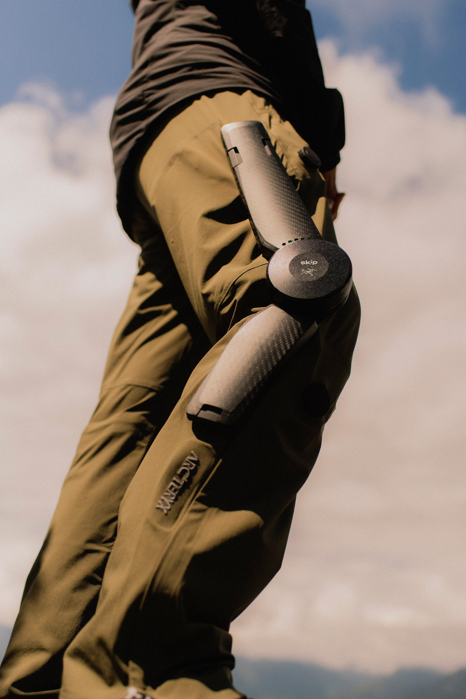

# **Patrick W. Franks**  
#### San Francisco, CA  
**[LinkedIn](https://www.linkedin.com/in/patrickfranks/)** | **[Google Scholar](https://scholar.google.com/citations?hl=en&user=Fzhk_ssAAAAJ)**  

---

### **About Me**  
I’m part of the team at **[Skip](https://www.skipwithjoy.com/)**, creating powered exoskeletons to bring joy to movement for the 1 billion people with reduced mobility. Previously, I worked on exoskeletons at Google X, Stanford, Carnegie Mellon, and the Shirley Ryan AbilityLab.

---
### **Skip in the Media**  
- **[Time: Best Inventions of 2024](https://time.com/7094544/arcteryx-and-skip-mo-go/)**  
- **[Fast Company](https://www.fastcompany.com/91159743/skip-and-arcteryx-built-an-amazing-new-exoskeleton-heres-what-its-like-to-walk-in-it)**  
- **[TechCrunch](https://techcrunch.com/2024/07/26/alphabet-x-spinoff-skip-partners-with-arcteryx-to-bring-everyday-exoskeleton-to-market/)**  
- **[Bloomberg](https://www.bloomberg.com/news/features/2024-05-20-google-s-era-of-unrestrained-invention-is-coming-to-an-end?embedded-checkout=true)**  

---

### **Selected Publications**  
1. **User preference optimization for control of ankle exoskeletons using sample-efficient active learning**  
   _[Science Robotics](https://www.science.org/doi/abs/10.1126/scirobotics.adg3705)_  

2. **Comparing optimized exoskeleton assistance of the hip, knee, and ankle in single and multi-joint configurations**  
   _[Wearable Technologies](https://drive.google.com/file/d/1av9UbwU8sU1n2MfBLboYuzJy3wKuslR6/view?usp=sharing)_  

3. **A hip–knee–ankle exoskeleton emulator for studying gait assistance**  
   _[International Journal of Robotics Research](https://drive.google.com/file/d/1RlrELrIbmDXIAGYLg4kIY1s8qJ0ibTUT/view?usp=share_link)_  

---

